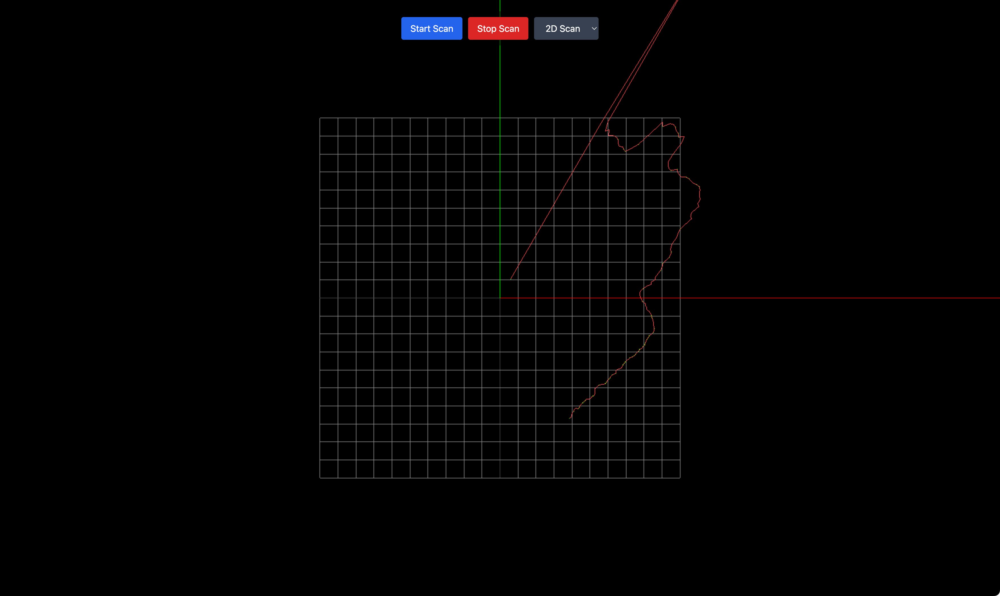

# NodeJS Lidar Visualizer
This is lidar visualization using Cyglidar D1 with NodeJS.
## Description
* 2D Scanning
* 3D Scanning (WIP)
## Getting Started
### Dependencies
` npm install `


### Executing program
` npm run dev `

## Help
Please check the supported driver on usb  serial 

Linux or Mac
```
ls /dev/ | grep usb
```

Windows 
```
Check on device managers and check USB devices
```
## Authors
[Muhammad Reza Maulana](https://linkedin.com/in/mrezzaaa)
## Version History
* 0.1


## Example
* 2D Scan


* 3D Scan

_WIP_